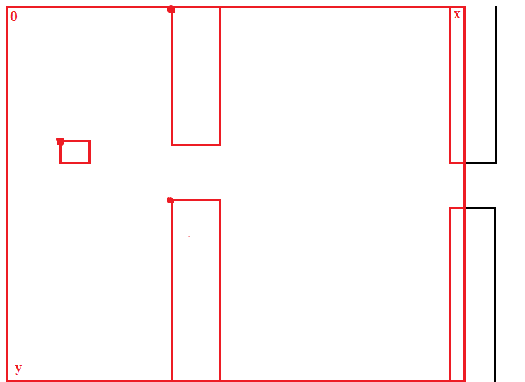

# Game Flappy Bird

Копия популярной мобильной игры Flappy Bird, написанная на языке JavaScript. [Играть](https://progivt19.github.io/jsTeamG/)

---

## Основное
При загрузке страницы в блоке `span` и `span#osts` подгружаются используемые изображения и музыка. Для создания графики используется элемент `canvas`.

```html
<canvas id="canvas" width="288" height="512">Your browser doesn't support html5 canvas</canvas>

<span id="osts">
	<audio id="ost1" src="assets/sounds/ost/ost1.ogg"></audio>
</span>

<span>
	
</span>
```

При запуске скриптового файла `game.js` создается экземпляр элемента canvas с последующим созданием объекта контекстного рисования в режиме двумерной графики. Также задаются настройки шрифта.

```JS
let
	canvas = document.getElementById('canvas'),
	ctx = canvas.getContext('2d');

ctx.fillStyle = "#000";
ctx.font = "20px Troika";
```

Далее создаются объекты изображений, звуков и музыки с указанием путей к оным. А также игровые переменные по типу позиции птички и счета.

```JS
let
	bg = new Image(), // фон
	ostList = document.getElementById("osts").getElementsByTagName("audio"); // получаем все объекты аудио из блока span#osts

bg.src = "assets\\background.png";

// позиция птички, скорость ее постоянного снижения; то, насколько будет птичка подниматься при каждом нажатии на space; то, как быстро птичка будет достигать этой величины
let xPos, yPos, gravity, offset, offset_per_iteration;
```

По наступлению события загрузки последнего элемента фоновой музыки вызывается анонимная функция, возвращающая вызов функции `reload`. Эта функция вызывается также и при поражении по окончанию анимации гибели. В ней все значения игровых переменных, кроме переменной `record`, переходят к значению по умолчанию; также в ней к событию клика по полотну(canvas) присваивается вызов функции start.

```JS
let moveUp = function(e) {
	/*
	в качестве аргумента передается объект <События нажатия>, содержащий в себе информацию о нем(например, то, какая клавиша была нажата)
	выполняется гладкая анимация полета птички, за счет последовательного изменения ее положения и последующей смене кадра
	анимация(взмах крыльями) достигается переменной сменой изображений из списка state
	после выполнения операции взлета проигрывается звук взмаха
	*/

	...
}

let start = function() {
	/*
	включает случайную фоновую музыку
	отсоединяет эту функцию от события клика по канвасу
	присваивает к событию нажатия на клавиву вызов функции moveUp
	очищает канвас от элементов предыдущего экрана
	вызывает основную функцию loop
	*/

	...
}

let reload = function() {
	/*
	дефолтные значения переменных
	создание начального экрана при загрузке страницы или после поражения
	*/

	...
	canvas.addEventListener('click', start); // присоединяем событие клика на начальном экране к функции start
}

ostList[ostList.length-1].onloadeddata = () => reload();
```

---

## Механика

Ниже для удобства представления наглядно изображено то, как выглядит координатная плоскость полотна и то, как на ней располагаются птичка и препятствия:



После того, как была вызвана основная функция loop, происходит ее выполнение, заключающееся в следующем:

1. Отрисовка фона `ctx.drawImage(bg, 0, 0);`
2. Последовательная отрисовка каждого из препятствий. Отрисовка происходит следующим образом: из списка pipe берется каждый из объектов, содержащих координаты. Эти координаты задают положение верхнего препятствия; нижнее же препятствие рисуется соответственно верхнему по формуле:
`<положение верхнего препятствия по Y(pipe[i].y)> + <высота верхнего препятствия(pipeUp.height)> + <пробел между ними(gap)>`
Положение по X у обоих препятствий одинаковое, при "спавне" оно всегда равно canvas.width(это значит, что препятствие спавнится "за сценой") и при каждой следующей итерации меняется на значение `speed` в левую сторону. Первое препятствие было определено при вызове функции reload, и имело координаты:
`x: canvas.width, y: -1 * (Math.floor(Math.random() * (pipeUp.height-50))) (объяснение формулы: см. пункт 3)`

```JS
for(let i = 0; i < pipe.length; i++) {
	ctx.drawImage(pipeUp, pipe[i].x, pipe[i].y); // верхнее препятствие
	ctx.drawImage(pipeDown, pipe[i].x, pipe[i].y + pipeUp.height + gap); // нижнее препятствие

	pipe[i].x -= speed;
```

3. Проверка(в том же цикле), соответствует ли положение данного препятствия(pipe[i]) по оси X заданному минимальному значению, пересечение которого знаменует появление "за сценой" нового препятствия. Положение нового препятствия по X - canvas.width, по Y - значение равное случайному числу в промежутке [-(pipeUp.height-50); 0]  (опорная точка будет находиться выше "потолка" полотна на величину от pipeUp.height-50 до 0).

```JS
if (pipe[i].x == 100) {
	pipe.push({
		x: canvas.width,
		y: -1 * (Math.floor(Math.random() * (pipeUp.height-50)))
	});
}
```

4. Проверка(в том же цикле), не коснулась ли птичка земли или какого либо из препятствий. Если позиция птички по Y + высота ее модельки больше, либо равна высоте полотна, то птичка явно коснулась земли. Если позиция птички по X + длина ее модельки больше, либо равна положению препятствия по X, а также ее позиция по X меньше, либо равна положению препятствия по X + длина модельки препятствия, то положения птички сейчас в пределах препятствий по оси X и тогда нужно проверить, находится ли она в пределах препятствий по оси Y. Если позиция птички по Y меньше, либо равна положению нижней части верхнего препятствия или позиция птички по Y больше, либо равна положению верхней части нижнего препятствия, то птичка явно коснулась его. Если условия выполняются, происходит возврат вызова функции fall(), описывающей действия в случае поражения.

```JS
// столкновение с низом
if (yPos + bird.height >= canvas.height) {
	return fall();
}

// столкновение со стеной
// вычеты сделаны с целью учета округлой формы птицы	
if (xPos + bird.width-5 >= pipe[i].x) { // птичка вошла в позицию стены
	if (xPos <= pipe[i].x + pipeUp.width-10) { // птичка еще не прошла через стены
		if ( (yPos+3 <= pipe[i].y + pipeUp.height) || (yPos + bird.height-2 >= pipe[i].y + pipeUp.height + gap) ) {
			// если позиция птички по Y меньше позиции нижней части верхней стены
			// либо позиция птички по Y больше позиции верхней части нижней стены

			return fall();
```

5. Проверка(в том же цикле), соответствует ли положение данного препятствия(`pipe[i]`) по оси X заданному минимальному значению, преодолевая которое препятствие считается пройденным. Если так, то счет(score) увеличивается на 1 и проигрывается соответствующий звук.

```JS
if (pipe[i].x == -50) {
	score++;
	score_audio.play();
}
```

6. По завершению работы цикла отрисовывается позиция птички(по X - постоянное значение, по Y - с каждым вызовом функции loop уменьшается на значение gravity); отображается текущий счет и рекорд(если таковой был поставлен ранее); запрашивается следующий фрейм.

```JS
ctx.drawImage(bird, xPos, yPos);
yPos += gravity; // действие гравитации
ctx.fillText("Счет: " + score, 5, 20);

if (record != 0) {
	ctx.fillText("Рекорд: " + record, 5, 40);
}

timer = requestAnimationFrame(loop);
```

7. Если птичка коснулась препятствия, функция loop возвращает вызов функции fall(). Та в свою очередь отсоединяет событие нажатия на клавишу от функции moveUp; дорисовывает фрейм, отрисовка которого была прервана(включая отображение нового рекорда, если таковой был поставлен); прекращает выполнение последних анимаций, содержащихся в `animation_` и `timer`; останавливает фоновую музыку; проигрывает звук удара о препятствие, выставляя небольшую паузу за счет асинхроноого вызова ожидающей функции sleep; увеличивает значение `gravity`, меняет состояние птички `bird.src = state[2];` и выполняет вызов вложенной функции fall_. Функция fall_ выполняет почти те же действия по отрисовке, что и функция loop. Вызов прекращается как только позиция птички по Y превышает высоту полотна.

```JS
if (yPos > canvas.height) {
	await
		sleep((game_over.duration - game_over.currentTime) * 1000); // ожидание(в ms) окончания проигрыша мелодии поражения

	ctx.clearRect(0, 0, canvas.width, canvas.height); // очистка канваса
	bird.src = state[0]; // смена состояния на обычное
	return reload(); // колесо сансары дало оборот
}
```